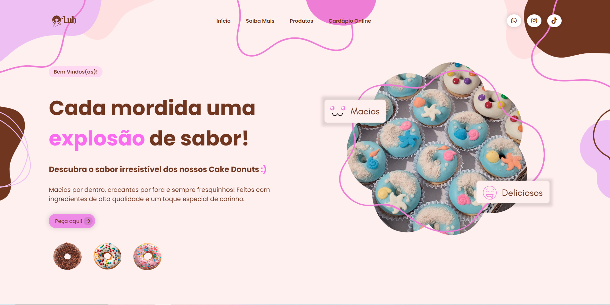

  

  

## Resumo do Projeto

Projeto em andamento, sobre venda de cake donuts.

- `Vendas Personalizadas`: Escolha entre uma variedade de sabores e coberturas, monte seu pedido e acompanhe cada etapa do processo, tudo de forma simples e intuitiva.

- `Gerenciamento de Vendas`: Modo ADM: Controle dos pedidos, acompanhamento de estoque e geração de relatórios. (Em desenvolvimento)

- `Design Intuitivo`: Navegação rápida e fácil.

Clique [aqui](https://luhcakedonuts.netlify.app/) e veja como ficou!

## Tecnologias Utilizadas

- HTML
- CSS
- JavaScript
